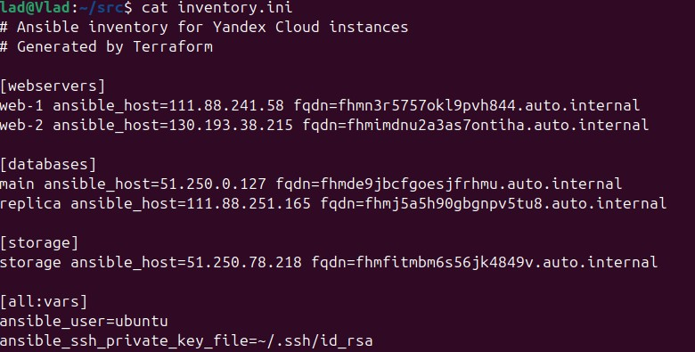

# Домашнее задание к занятию "Основы Terraform. Yandex Cloud" - `Вялов Владислав`

## Задание 1

Ответьте, как в процессе обучения могут пригодиться параметры preemptible = true и core_fraction=5 в параметрах ВМ.

Ответ:

preemptible = true (прерываемая ВМ)
Польза в обучении: Экономия бюджета — стоимость в 2-3 раза ниже обычных ВМ, отказоустойчивость — можно учиться восстанавливать сервисы после внезапных остановок, возможность запускать ВМ на 24 часа без больших затрат, вместо одной  ВМ можно запустить 3 прерываемых

core_fraction = 5 (5% производительности ядра)
Польза в обучении: Максимальная экономия — стоимость до 95% ниже обычных ВМ, Достаточно для базовых задач — изучение Linux, написание скриптов, настройка сетей, можно запустить 20-30 учебных ВМ по цене одной обычной, отлично для отладки конфигураций без высокой нагрузки

## Задание 2

## Задание 3

## Задание 4

## Задание 5

## Задание 6

